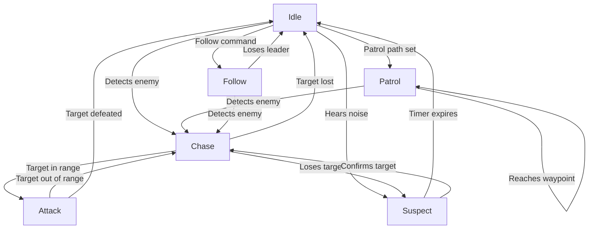

# AI System - Comprehensive Documentation

## Table of Contents

1. [Overview](#overview)
2. [Core Components](#core-components)
   - [AiController](#aicontroller)
   - [AiMovement](#aimovement)
   - [AiPerception](#aiperception)
   - [AiBehaviorState](#aibehaviorstate)
3. [System Architecture](#system-architecture)
4. [Behavior System](#behavior-system)
   - [State Machine](#state-machine)
   - [State Transitions](#state-transitions)
5. [Perception System](#perception-system)
   - [Vision](#vision)
   - [Hearing](#hearing)
   - [Field of View](#field-of-view)
6. [Faction System](#faction-system)
   - [Faction Relations](#faction-relations)
   - [Friend/Foe Detection](#friendfoe-detection)
7. [Movement System](#movement-system)
   - [Navigation](#navigation)
   - [Path Following](#path-following)
8. [Advanced Features](#advanced-features)
   - [Patrol System](#patrol-system)
   - [Turret System](#turret-system)
   - [Combat System](#combat-system)
   - [Hiding System](#hiding-system)
9. [Visualization](#visualization)
   - [Vision Cones](#vision-cones)
   - [State Icons](#state-icons)
10. [Setup and Usage](#setup-and-usage)
11. [Performance Considerations](#performance-considerations)
12. [Customization Guide](#customization-guide)

## Overview

The AI System in Bevy All-in-One Controller provides a comprehensive framework for creating intelligent non-player characters (NPCs) with advanced behaviors, perception, and decision-making capabilities. The system is designed to be modular, extensible, and performance-oriented.

## Core Components

### AiController

The main AI component that controls behavior and state:

```rust
#[derive(Component, Debug, Reflect)]
pub struct AiController {
    pub state: AiBehaviorState,              // Current AI state
    pub target: Option<Entity>,              // Current target entity
    pub patrol_path: Vec<Vec3>,              // Patrol waypoints
    pub current_waypoint_index: usize,       // Current patrol index
    pub detection_range: f32,                // Detection range (default: 15.0)
    pub attack_range: f32,                   // Attack range (default: 2.5)
    pub patrol_speed_mult: f32,              // Patrol speed multiplier (default: 0.5)
    pub chase_speed_mult: f32,               // Chase speed multiplier (default: 1.0)
    pub wait_timer: f32,                     // Current wait timer
    pub wait_time_between_waypoints: f32,    // Waypoint wait time (default: 2.0)
    pub suspicion_timer: f32,                // Suspicion timer
    pub max_suspicion_time: f32,             // Max suspicion time (default: 5.0)
    pub wander_radius: f32,                  // Wander radius (default: 10.0)
    pub wander_center: Vec3,                 // Wander center point
    pub target_last_position: Option<Vec3>,   // Last known target position
}
```

### AiMovement

Controls AI movement parameters:

```rust
#[derive(Component, Debug, Reflect, Default)]
pub struct AiMovement {
    pub destination: Option<Vec3>,           // Current destination
    pub speed: f32,                          // Movement speed
    pub acceleration: f32,                   // Movement acceleration
    pub stop_distance: f32,                  // Stop distance from target
    pub move_type: AiMovementType,           // Movement type
}

#[derive(Debug, Clone, Copy, PartialEq, Eq, Reflect, Default)]
pub enum AiMovementType {
    #[default]
    Walk,
    Run,
    Sprint,
    Crouch,
}
```

### AiPerception

Handles AI sensory capabilities:

```rust
#[derive(Component, Debug, Reflect)]
pub struct AiPerception {
    pub fov: f32,                            // Field of view in degrees
    pub vision_range: f32,                   // Vision range
    pub visible_targets: Vec<Entity>,        // Currently visible targets
}
```

### AiBehaviorState

Defines all possible AI states:

```rust
#[derive(Debug, Clone, Copy, PartialEq, Eq, Reflect)]
pub enum AiBehaviorState {
    Idle,       // No activity
    Patrol,     // Following patrol path
    Chase,      // Pursuing target
    Attack,     // Attacking target
    Flee,       // Running away
    Follow,     // Following friendly entity
    Hide,       // Hiding from threats
    Combat,     // In combat mode
    Turret,     // Turret mode
    Dead,       // Dead/incapacitated
    Wander,     // Random wandering
    Suspect,    // Suspicious state
}
```

## System Architecture

The AI system uses a multi-system approach with proper execution order:

### Update Systems
- `update_ai_perception` - Processes vision and target detection
- `update_ai_hearing` - Processes sound/noise detection
- `handle_friend_commands` - Handles friendly AI commands
- `update_ai_behavior` - Updates AI behavior state machine
- `update_ai_suspicion` - Manages suspicion timers
- `update_ai_movement` - Handles AI movement
- `update_patrol` - Manages patrol behavior
- `update_turrets` - Handles turret AI
- `update_ai_combat` - Manages combat behavior
- `update_ai_hiding` - Handles hiding behavior
- `draw_ai_vision_cones` - Visualizes AI vision
- `update_ai_state_visuals` - Updates state visualization
- `update_faction_relations` - Manages faction relationships
- `alert_faction_members` - Alerts faction members

## Behavior System

### State Machine

The AI uses a finite state machine with the following states:

**Passive States:**
- `Idle`: AI is inactive
- `Wander`: AI moves randomly within area
- `Patrol`: AI follows predefined path
- `Follow`: AI follows friendly entity

**Alert States:**
- `Suspect`: AI is suspicious but no target confirmed
- `Chase`: AI is pursuing a target
- `Attack`: AI is attacking a target

**Special States:**
- `Hide`: AI is hiding from threats
- `Flee`: AI is running away
- `Combat`: AI is in combat mode
- `Turret`: AI is in turret mode
- `Dead`: AI is dead/incapacitated

### State Transitions

The AI transitions between states based on perception and environmental factors:



## Perception System

### Vision

The vision system uses:
- **Field of View (FOV)**: Configurable angle for vision
- **Raycasting**: Line-of-sight detection with obstacle checking
- **Faction Filtering**: Only detects enemies based on faction relations
- **Distance Limitation**: Respects vision range limits

**Vision Process:**
1. Check if target is within range
2. Check if target is within FOV angle
3. Perform raycast to verify line of sight
4. Check faction relations
5. Add to visible targets list

### Hearing

The hearing system responds to noise events:
- **NoiseEventQueue**: Global resource for noise events
- **Volume Attenuation**: Sound volume decreases with distance
- **Suspicion Generation**: Noise triggers suspicion state
- **Investigation**: AI moves to noise location

**Hearing Process:**
1. Check if noise is within hearing range
2. Apply volume attenuation based on distance
3. If audible, set AI to Suspect state
4. Store noise position as investigation target

### Field of View

The FOV system uses:
- **Configurable Angle**: Typically 90-120 degrees
- **Directional Detection**: Only detects targets in facing direction
- **Visualization**: Debug drawing of vision cones
- **Performance Optimization**: Spatial queries for efficient detection

## Faction System

### Faction Relations

The faction system manages relationships between different groups:

```rust
#[derive(Debug, Clone, Copy, PartialEq, Eq, Reflect, Default)]
pub enum FactionRelation {
    #[default]
    Neutral,   // No special relationship
    Friend,    // Friendly relationship
    Enemy,     // Hostile relationship
}

#[derive(Resource, Debug, Reflect, Default)]
pub struct FactionSystem {
    pub factions: Vec<FactionInfo>,
    pub relations: Vec<FactionRelationInfo>,
}
```

### Friend/Foe Detection

The system automatically determines relationships:
- **Same Faction**: Always friendly
- **Configured Relations**: Uses relation table
- **Default**: Neutral if no relation defined
- **Dynamic Changes**: Relations can change during gameplay

**Faction Detection Process:**
1. Get AI's faction
2. Get target's faction
3. Check if same faction → Friendly
4. Look up in relations table
5. Return appropriate relation

## Movement System

### Navigation

The movement system provides:
- **Waypoint Following**: Smooth path following
- **Obstacle Avoidance**: Basic collision avoidance
- **Speed Control**: Variable speeds for different states
- **Acceleration**: Smooth speed transitions

### Path Following

The patrol system includes:
- **Waypoint Navigation**: Follows predefined paths
- **Looping Paths**: Optional path looping
- **Waypoint Waiting**: Configurable wait times
- **Smooth Transitions**: Gradual direction changes

## Advanced Features

### Patrol System

The patrol system allows AI to follow predefined paths:

```rust
#[derive(Component, Debug, Reflect, Default)]
pub struct PatrolPath {
    pub waypoints: Vec<Vec3>,   // List of waypoints
    pub loop_path: bool,        // Whether to loop the path
}
```

**Patrol Behavior:**
1. Move to current waypoint
2. Wait at waypoint for configured time
3. Move to next waypoint
4. Loop or reverse if path ends

### Turret System

Specialized AI for stationary turrets:
- **Fixed Position**: Turrets don't move
- **Rotation Only**: Turrets rotate to face targets
- **Automatic Targeting**: Auto-detects and tracks targets
- **Specialized Combat**: Turret-specific attack patterns

### Combat System

The combat system handles:
- **Target Selection**: Chooses appropriate targets
- **Attack Patterns**: Different attack behaviors
- **Range Management**: Maintains optimal distance
- **Combat State**: Specialized combat behavior

### Hiding System

The hiding system allows AI to:
- **Find Hide Positions**: Locates marked hiding spots
- **Take Cover**: Moves to and uses cover
- **Peek Behavior**: Partial exposure while hiding
- **Cover Selection**: Chooses optimal cover

## Visualization

### Vision Cones

The system provides debug visualization:
- **Color Coding**: Normal (white) vs Alert (red)
- **FOV Display**: Shows field of view boundaries
- **Range Indicators**: Visualizes detection range
- **Toggleable**: Can be enabled/disabled

```rust
#[derive(Component, Debug, Reflect)]
pub struct AiVisionVisualizer {
    pub active: bool,               // Enable/disable visualization
    pub normal_color: Color,        // Normal state color
    pub alert_color: Color,         // Alert state color
}
```

### State Icons

Visual indicators for AI state:
- **Icon Spawning**: Creates visual indicators
- **Position Offset**: Icons appear above AI
- **Interval Control**: Configurable spawn rate
- **State-Specific**: Different icons for different states

## Setup and Usage

### Basic AI Setup

```rust
use bevy::prelude::*;
use bevy_allinone::prelude::*;

fn spawn_basic_ai(commands: &mut Commands, position: Vec3) -> Entity {
    commands.spawn((
        Name::new("Basic AI"),
        AiController {
            state: AiBehaviorState::Idle,
            detection_range: 15.0,
            attack_range: 2.5,
            ..default()
        },
        AiMovement::default(),
        AiPerception {
            fov: 90.0,
            vision_range: 20.0,
            ..default()
        },
        AiVisionVisualizer::default(),
        CharacterFaction {
            name: "Enemy".to_string(),
        },
        Transform::from_translation(position),
        GlobalTransform::default(),
    ))
    .insert((
        // Add character controller components
        CharacterController::default(),
        CharacterMovementState::default(),
        InputState::default(),
        
        // Add physics components
        RigidBody::Dynamic,
        Collider::capsule(0.4, 1.0),
        LockedAxes::ROTATION_LOCKED,
        GravityScale(1.0),
        Friction::new(0.0),
        Restitution::new(0.0),
        LinearVelocity::default(),
        AngularVelocity::default(),
    ))
    .id()
}
```

### Patrol AI Setup

```rust
fn spawn_patrol_ai(commands: &mut Commands) -> Entity {
    let patrol_path = vec![
        Vec3::new(0.0, 0.0, 0.0),
        Vec3::new(5.0, 0.0, 0.0),
        Vec3::new(5.0, 0.0, 5.0),
        Vec3::new(0.0, 0.0, 5.0),
    ];
    
    commands.spawn((
        Name::new("Patrol AI"),
        AiController {
            state: AiBehaviorState::Patrol,
            patrol_path: patrol_path,
            wait_time_between_waypoints: 3.0,
            patrol_speed_mult: 0.7,
            ..default()
        },
        // ... other components
    ))
    .id()
}
```

### Faction Setup

```rust
fn setup_factions(mut commands: Commands) {
    // Initialize faction system
    let mut faction_system = FactionSystem::default();
    
    // Add factions
    faction_system.factions.push(FactionInfo {
        name: "Player".to_string(),
        turn_to_enemy_if_attacked: true,
        turn_faction_to_enemy: false,
        friendly_fire_turn_into_enemies: false,
    });
    
    faction_system.factions.push(FactionInfo {
        name: "Enemy".to_string(),
        turn_to_enemy_if_attacked: true,
        turn_faction_to_enemy: false,
        friendly_fire_turn_into_enemies: true,
    });
    
    faction_system.factions.push(FactionInfo {
        name: "Neutral".to_string(),
        turn_to_enemy_if_attacked: true,
        turn_faction_to_enemy: false,
        friendly_fire_turn_into_enemies: false,
    });
    
    // Set faction relations
    faction_system.relations.push(FactionRelationInfo {
        faction_a: "Player".to_string(),
        faction_b: "Enemy".to_string(),
        relation: FactionRelation::Enemy,
    });
    
    faction_system.relations.push(FactionRelationInfo {
        faction_a: "Player".to_string(),
        faction_b: "Neutral".to_string(),
        relation: FactionRelation::Neutral,
    });
    
    commands.insert_resource(faction_system);
}
```

## Performance Considerations

### Optimization Techniques

1. **Spatial Partitioning**: Uses Bevy's spatial query system
2. **Early Exit**: Skips processing for dead/fleeing AI
3. **Component Organization**: Data organized for cache efficiency
4. **Batch Processing**: Processes all AI in single systems
5. **Distance Culling**: Only processes AI within relevant ranges

### Performance Tips

- Limit number of active AI entities
- Use simpler behavior for background AI
- Reduce perception range for distant AI
- Disable visualization in production builds
- Use object pooling for frequent AI spawning

## Customization Guide

### Creating Custom AI States

```rust
// Extend AiBehaviorState enum
#[derive(Debug, Clone, Copy, PartialEq, Eq, Reflect)]
pub enum AiBehaviorState {
    // ... existing states ...
    CustomState,      // Your custom state
    SpecialAbility,   // Another custom state
}

// Add custom behavior logic
fn update_ai_behavior(
    time: Res<Time>,
    mut ai_query: Query<(&mut AiController, &mut InputState)>
) {
    for (mut ai, mut input) in ai_query.iter_mut() {
        match ai.state {
            AiBehaviorState::CustomState => {
                // Your custom behavior logic
                input.movement = Vec2::new(1.0, 0.0); // Example movement
                // Add your custom state transitions
            }
            AiBehaviorState::SpecialAbility => {
                // Special ability logic
                input.attack_pressed = true;
                // Handle ability cooldowns, etc.
            }
            // ... existing state handling ...
        }
    }
}
```

### Extending Perception

```rust
// Add custom perception components
#[derive(Component, Debug, Reflect)]
pub struct CustomPerception {
    pub custom_detection_range: f32,
    pub custom_sense_type: CustomSenseType,
}

// Add custom perception system
fn update_custom_perception(
    mut ai_query: Query<(&GlobalTransform, &mut AiController, &CustomPerception)>
) {
    for (transform, mut ai, custom_perception) in ai_query.iter_mut() {
        // Your custom perception logic
        // Could detect special objects, environmental factors, etc.
        
        if detects_custom_condition(transform.translation(), custom_perception) {
            ai.state = AiBehaviorState::Chase; // Or custom state
            // Set target or other parameters
        }
    }
}
```

### Custom Movement Patterns

```rust
// Extend AiMovementType
#[derive(Debug, Clone, Copy, PartialEq, Eq, Reflect, Default)]
pub enum AiMovementType {
    // ... existing types ...
    CustomMovement,   // Your custom movement type
}

// Add custom movement system
fn update_custom_movement(
    time: Res<Time>,
    mut query: Query<(&mut AiMovement, &mut CharacterController, &mut InputState)>
) {
    for (mut movement, mut controller, mut input) in query.iter_mut() {
        if movement.move_type == AiMovementType::CustomMovement {
            // Your custom movement logic
            // Could implement formation movement, flocking, etc.
            
            input.movement = calculate_custom_movement_direction();
            controller.run_speed = calculate_custom_speed();
        }
    }
}
```

## Best Practices

1. **State Management**: Keep state transitions clear and predictable
2. **Component Organization**: Group related data in components
3. **Performance**: Optimize perception systems first
4. **Debugging**: Use visualization tools during development
5. **Testing**: Test AI in various scenarios
6. **Documentation**: Document custom AI behaviors

## Troubleshooting

### Common Issues

**AI doesn't detect targets:**
- Check faction relations
- Verify perception settings (FOV, range)
- Ensure line of sight is clear
- Check if AI is in appropriate state

**AI gets stuck:**
- Verify patrol path waypoints
- Check for obstacles in path
- Ensure movement components are properly set up
- Verify collision settings

**AI doesn't attack:**
- Check attack range settings
- Verify target is within range
- Ensure AI is in Chase state first
- Check weapon/attack components

**Performance issues:**
- Limit number of active AI
- Reduce perception ranges
- Optimize spatial queries
- Profile AI systems

## Future Enhancements

Potential areas for expansion:
- Advanced pathfinding (A*, navmesh)
- Formation movement
- Flocking/boid behaviors
- Advanced combat tactics
- Day/night cycles affecting perception
- Environmental awareness
- Memory system for past events
- Learning/adaptive behaviors