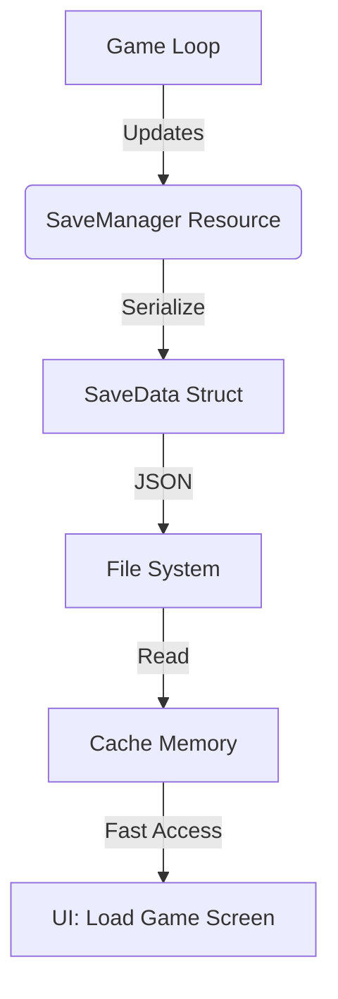

# Save System

The **Save System** is the persistence backbone of the application, managing the serialization, storage, and retrieval of game state. It provides a robust framework for handling multiple save slots, auto-saving, checkpoints, and ensuring data integrity across sessions.

Built on `serde` and `serde_json`, it offers human-readable save files that are easy to debug and extend, while abstracting the complexities of File I/O behind a clean, resource-based API.

## Overview

The system is designed as a centralized resource (`SaveManager`) that acts as the single source of truth for all persistence operations. It does not auto-magically save every component in the ECS world; instead, it relies on a structured `SaveData` snapshot object that gathers relevant state from various systems (Player, Inventory, World) at the moment of saving.

### Key Features
- **Slot Management**: Supports arbitrary number of save slots (Default: 10).
- **Auto-Save**: configurable interval-based saving to a reserved slot.
- **Checkpoints**: dedicated API for "safe point" saves (e.g., before a boss fight).
- **Metadata Caching**: fast loading of save headers (Time played, Chapter, Date) without reading the entire heavy JSON body.
- **Fail-Safe I/O**: file operations handle errors gracefully to prevent save corruption.

## Architecture



### The `SaveManager` Resource
This is the heart of the system. It maintains the cache of what slots are used, configuration for auto-saving, and the current active slot index.

```rust
#[derive(Resource, Debug)]
pub struct SaveManager {
    // Configuration
    pub max_save_slots: usize,      // Default: 10
    pub save_directory: PathBuf,    // Default: "./saves"
    pub auto_save_enabled: bool,
    pub auto_save_interval: f32,    // Default: 300s (5 mins)
    
    // State
    pub current_save_slot: usize,
    pub current_save_data: Option<SaveData>,
    pub save_slots_cache: HashMap<usize, SaveSlotInfo>,
}
```

### File System Layout
Saves are stored as individual JSON files in the specified directory.
- `save_data_0.json` (Slot 0)
- `save_data_1.json` (Slot 1)
- ...
- `save_data_8.json` (Auto-Save Slot)
- `save_data_9.json` (Checkpoint Slot)

*Note: The specific slot indices for Auto-Save and Checkpoint are dynamic based on `max_save_slots`. Auto-save uses `max - 2`, Checkpoint uses `max - 1`.*

## Data Models

The `SaveData` struct is the "Snapshot" of the world. It is a flat structure that collects data from various disparate systems into a cohesive serializable format.

### `SaveData`
| Field | Type | Description |
| :--- | :--- | :--- |
| `player_position` | `Vec3` | World coordinates of the player. |
| `player_rotation` | `Quat` | Heading/Orientation. |
| `player_health` | `f32` | Current hit points. |
| `inventory_items` | `Vec<SavedInventoryItem>` | List of carried items. |
| `game_progress` | `GameProgress` | Quest states and unlocks. |
| `scene_index` | `u32` | Which map/level to load. |
| `save_date` | `DateTime<Utc>` | Timestamp of creation. |
| `play_time` | `f32` | Total seconds played. |

```json
{
  "player_position": [10.5, 0.0, -5.2],
  "player_health": 85.0,
  "scene_index": 2,
  "game_progress": {
    "chapter": 3,
    "quest_progress": {
      "FindTheKey": 1,
      "KillRats": 5
    }
  },
  "custom_data": {
    "weather_state": "raining"
  }
}
```

### `GameProgress`
Tracks the narrative and exploration state.

```rust
pub struct GameProgress {
    pub chapter: u32,
    pub quest_progress: HashMap<String, u32>,
    pub unlocked_abilities: Vec<String>,
    pub discovered_areas: Vec<String>, // "Map Fog" data
    pub custom_progress: HashMap<String, Value>,
}
```

### `EquipementData`
Specific references to item IDs equipped in slots.

```rust
pub struct EquipmentData {
    pub weapon: Option<String>,    // Item ID (e.g., "sword_iron")
    pub armor: Option<String>,
    pub accessory: Option<String>,
    pub custom_slots: HashMap<String, String>,
}
```

## Core Features Implementation

### Auto-Save Cycle
The system includes `auto_save_system` which runs during the `Update` schedule.

1.  **Tick**: Increases `time_since_last_save` by `time.delta_secs()`.
2.  **Check**: If `time > interval`:
    - Resets timer.
    - Queries the ECS world for `Transform`, `Health`, and `Inventory` components.
    - Constructs a fresh `SaveData` object.
    - Calls `save_manager.auto_save(data)`.
3.  **IO**: Writes to the reserved auto-save slot (`max_save_slots - 2`).

### Checkpoint Logic
Checkpoints are distinct from regular saves. They are typically triggered by level triggers (entering a dungeon, resting at a campfire).

```rust
// Saving a checkpoint
let data = capture_current_state(); // Implementation dependent
save_manager.save_checkpoint(42, data); // ID 42 could map to "Dungeon Entrance"

// Loading a checkpoint
// Often acts as the "Respawn" mechanic
if player_died {
    let save = save_manager.load_checkpoint()?;
    restore_state(save);
}
```

### Caching (`SaveSlotInfo`)
To avoid reading 10MB JSON files just to display a "Load Game" menu, the manager maintains a lightweight cache called `SaveSlotInfo`.

When `init()` is called, it:
1.  Scans the directory.
2.  Reads each file.
3.  Extracts *metadata only* (Time, Date, Chapter).
4.  Stores it in `save_slots_cache`.

This allows the UI to render the Load Screen instantly.

## Integration Guide

### 1. Initialization
You must add the plugin to your app to register the resource and systems.
```rust
app.add_plugins(SavePlugin);
```
*Note: The system creates the `./saves` directory automatically if missing.*

### 2. Saving the Game
Saving is not automatic for manual slots. You must implement a "Save Game" trigger (usually UI button or key press).

**The Challenge**: You need to gather data from ECS components into `SaveData`.

```rust
fn manual_save_system(
    input: Res<Input<KeyCode>>,
    mut save_manager: ResMut<SaveManager>,
    player_query: Query<(&Transform, &Health, &Inventory)>
) {
    if input.just_pressed(KeyCode::F5) {
        if let Ok((trans, health, inv)) = player_query.get_single() {
            // 1. Construct the Snapshot
            let data = SaveData {
                player_position: trans.translation,
                player_health: health.current,
                // ... populate field by field
                ..save_manager.new_game() // Use defaults for missing fields
            };
            
            // 2. Commit to Disk (Slot 1)
            if let Err(e) = save_manager.save_game(1, data) {
                error!("Save failed: {}", e);
            } else {
                info!("Game Saved!");
            }
        }
    }
}
```

### 3. Loading the Game
Loading is the inverse process. You read the `SaveData` and then *apply* it to the ECS world.

```rust
fn load_game_trigger(
    mut save_manager: ResMut<SaveManager>,
    mut commands: Commands,
    mut player_query: Query<&mut Transform>
) {
    // 1. Load from Disk
    match save_manager.load_game(1) {
        Ok(data) => {
            // 2. Apply State
            if let Ok(mut trans) = player_query.get_single_mut() {
                trans.translation = data.player_position;
                trans.rotation = data.player_rotation;
            }
            
            // 3. Respawn items / Despawn old ones
            // ... complex logic to sync world state
        }
        Err(e) => error!("Load failed: {}", e),
    }
}
```

### 4. Custom Data Extension
The `custom_data` HashMap in `SaveData` is your escape hatch for features not core to the engine (e.g., Weather, specific puzzle states).

**Writing:**
```rust
data.custom_data.insert(
    "weather".to_string(), 
    serde_json::to_value("stormy").unwrap()
);
```

**Reading:**
```rust
if let Some(val) = data.custom_data.get("weather") {
    let weather_str: String = serde_json::from_value(val.clone()).unwrap();
    weather_system.set_weather(&weather_str);
}
```

## API Reference

### `SaveManager` Methods

#### `init(&mut self) -> Result<(), String>`
Must be called at startup. Bootstraps the filesystem and cache. Returns error if file permissions denied.

#### `save_game(&mut self, slot: usize, data: SaveData)`
Writes the full JSON payload to disk.
- **Constraints**: `slot` must be `< max_save_slots`.
- **Side Effects**: updates `current_save_slot` and `current_save_data`.

#### `load_game(&mut self, slot: usize) -> Result<SaveData, String>`
Reads JSON from disk, parses it, and updates internal state.
- **Returns**: The full `SaveData` object.
- **Errors**: File not found, corrupted JSON.

#### `continue_game(&mut self) -> Result<SaveData, String>`
Smart loader. Iterates all slots to find the one with the most recent `save_date`.
- **Usage**: "Continue" button on Main Menu.

#### `new_game(&mut self) -> SaveData`
Returns a factory-reset `SaveData` object with default values (Level 1, full health, start position). Useful for starting a fresh run.

#### `delete_save(&mut self, slot: usize)`
Permanently removes the file and clears the cache entry.

## Best Practices

### 1. Robust Versioning
The current implementation uses simple Serde mappings. If you rename a field in `SaveData`, old save files will fail to load.
*Recommendation*:
- Use `#[serde(default)]` for new fields added in updates, so old saves simply assume default values.
- Do not rename fields. Deprecate old ones and add new ones if logic changes.

### 2. Async Saving
The current implementation uses synchronous `File::write_all`. For large saves (5MB+), this causes a frame stutter.
*Recommendation*:
- Offload the `serde_json::to_string` and file writing to a background thread (`std::thread` or `bevy::tasks`).

### 3. Save Bloat
`Vec<SavedInventoryItem>` can grow indefinitely.
*Recommendation*:
- Do not save items that are identical to their static database definitions. Only save `item_id` and `quantity` unless there is dynamic data (durability, enchantments).
- Prune `custom_data` of temporary flags.

## Troubleshooting

### "Load Game fails with 'trailing characters' error"
**Cause**: You manually edited the JSON file and left a syntax error or invisible character.
**Fix**: Validate the JSON in a linter. Ensure the file is UTF-8 encoded.

### "Auto-save isn't triggering"
**Cause**: `time_since_last_save` is resetting but the query for player components fails (e.g., player is dead/despawned).
**Fix**: Ensure `auto_save_system` checks for `Option` or handles validity of the player entity before attempting to save.

### "Thumbnail path is always None"
**Cause**: Thumbnail capture system is not implemented in the current code version.
**Fix**: Currently `thumbnail_path` is a placeholder. You need to implement a system that renders the camera to a texture, saves it as PNG, and puts the path here.

## JSON Schema Example

A complete example of a valid save file:

```json
{
  "player_position": { "x": 12.0, "y": 0.0, "z": -45.0 },
  "player_rotation": { "x": 0.0, "y": 0.707, "z": 0.0, "w": 0.707 },
  "player_health": 100.0,
  "player_stamina": 80.0,
  "inventory_items": [
    {
      "id": "potion_health",
      "name": "Health Potion",
      "quantity": 3,
      "durability": null,
      "custom_data": {}
    },
    {
      "id": "sword_rusty",
      "name": "Rusty Sword",
      "quantity": 1,
      "durability": 45.5,
      "custom_data": {}
    }
  ],
  "equipment": {
    "weapon": "sword_rusty",
    "armor": null,
    "accessory": null,
    "custom_slots": {}
  },
  "game_progress": {
    "chapter": 1,
    "quest_progress": {
      "tutorial_complete": 1
    },
    "unlocked_abilities": ["dash"],
    "discovered_areas": ["village_center"],
    "custom_progress": {}
  },
  "scene_index": 1,
  "play_time": 120.5,
  "save_date": "2023-10-27T10:00:00Z",
  "save_slot": 0,
  "is_checkpoint": false,
  "checkpoint_id": null,
  "camera_orientation": null,
  "is_driving": false,
  "current_vehicle": null,
  "custom_data": {}
}
```
