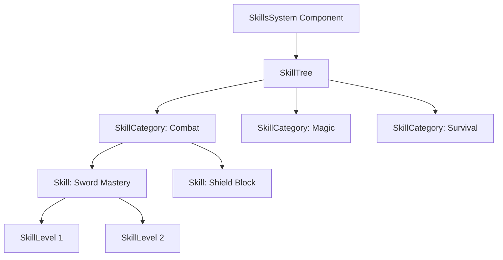

# Skills System

The **Skills System** provides a comprehensive framework for character progression, allowing for the creation of complex skill trees, ability unlocks, and passive attribute upgrades. It is designed to work in tandem with the **Stats System** and **Interaction System** to govern what a character can do and how effective they are at doing it.

## Overview

The system is built around a hierarchical structure that organizes individual skills into logical groups. It supports three distinct types of skills:
1.  **Numeric**: Passive statistical bonuses (e.g., "+10% Damage").
2.  **Boolean**: Binary unlocks (e.g., "Unlock Double Jump").
3.  **Leveled**: Skills that evolve through multiple distinct stages (e.g., "Fireball I" -> "Fireball II" -> "Fireball III").

Central to the system is the concept of **Skill Points**, which are the currency used to purchase upgrades. The system handles the validation logic (checking requirements, costs, and dependencies) automatically.

## Architecture

The data structure follows a strict container hierarchy:



### Core Components

#### `SkillsSystem`
The top-level component attached to the player entity. It acts as the facade for all skill-related operations.
- **Responsibility**: Manages the active `SkillTree`, handles save/load operations, and tracks the "current" selected skill in a UI context.

#### `SkillTree`
The root container for all progression data.
- **Responsibility**: Holds a list of `SkillCategory` objects. It provides search methods to find specific skills by name or index across all categories.

#### `SkillCategory`
A logical grouping of skills (e.g., "Pyromancy", "Archery").
- **Responsibility**: Organizes skills for UI display and thematic grouping.

#### `Skill`
The atom of the system. Represents a single upgrade node.
- **Responsibility**: Stores state (Unlocked? Active? Level?), configuration (Cost, Max Level), and the effects (`SkillEvent`) associated with the skill.

## Skill Types

The behavior of a skill is defined by its `SkillType` enum.

### 1. Numeric Skills
These skills directly modify a floating-point value. They are typically used for passive stat boosts.
- **Usage**: "Increase Max Health by 50."
- **Logic**: When activated, the system assumes this maps to a stat modification.

### 2. Boolean Skills
These skills act as flags or switches.
- **Usage**: "Unlock Night Vision."
- **Logic**: Used by other systems (like the Camera System) to check if a feature is available (`if skills.get_skill_bool_value("Night Vision") { ... }`).

### 3. Leveled Skills
These are complex skills that have multiple stages.
- **Usage**: "Strength Training (Level 1-5)".
- **Structure**: Contains a vector of `SkillLevel` objects. Each level can have its own description, cost, and effect value.
- **Progression**: Buying the skill advances `current_level` by 1.

## Data Structures

### The `Skill` Struct

The `Skill` struct is feature-rich, handling various configuration scenarios.

```rust
pub struct Skill {
    // Identity
    pub name: String,
    pub description: String,
    pub skill_type: SkillType,

    // State
    pub enabled: bool,      // Is it visible/available?
    pub unlocked: bool,     // Has the prerequisite been met?
    pub active: bool,       // Has it been purchased/equipped?
    pub complete: bool,     // Is it maxed out?
    
    // Progression
    pub current_level: u32,
    pub max_level: u32,
    pub required_points: u32,

    // Values
    pub current_value: f32,
    pub value_to_configure: f32, // The target value when purchased
    
    // Logic Hooks
    pub on_initialize: SkillEvent,
    pub on_increase: SkillEvent,
    pub on_activate_bool: SkillEvent,
}
```

### The `SkillEvent` Enum

This enum bridges the data-only Skill System with the rest of the game logic. It describes *what happening* when a skill changes.

```rust
pub enum SkillEvent {
    None,
    WithValue(f32),     // "Add value X to stat Y"
    WithBool(bool),     // "Set flag Z to true"
    Simple,             // Just trigger a generic event
}
```

## Progression Logic

### Unlocking & Requirements
Skills can have an `unlocked` state separate from `active`.
- **Locked**: The player cannot see or buy this skill yet (e.g., unmet prerequisites).
- **Unlocked**: The skill is visible and purchasable.
- **Active**: The skill has been purchased and its effects are applied.

### Leveling Up
The `level_up` method handles the transaction of spending points to upgrade a skill.

1.  **Validation**:
    - Is the skill unlocked?
    - Is it not yet complete (`current_level < max_level`)?
    - Does the player have enough points?
2.  **Transaction**:
    - Deduct points (handled by caller typically, or validated here).
    - Increment `current_level`.
    - Update `current_value` to the new level's value.
3.  **Completion**:
    - If `current_level >= max_level`, mark `complete = true`.

## Usage Patterns

### Defining a New Skill Tree
This is typically done during the `Startup` phase or when initializing a new character.

```rust
fn setup_skills(mut commands: Commands) {
    let mut skill_tree = SkillTree::new();

    // Create a "Combat" category
    let mut combat = SkillCategory::new("Combat");

    // Add a "Strong Arm" skill (Numeric)
    let mut strong_arm = Skill::new(
        "Strong Arm",
        "Increases throwing distance.",
        SkillType::Numeric
    );
    strong_arm.value_to_configure = 10.0; // Adds 10.0 distance
    strong_arm.required_points = 2;
    strong_arm.unlock(); // Available immediately

    combat.add_skill(strong_arm);

    // Add a "Double Jump" skill (Boolean)
    let mut double_jump = Skill::new(
        "Double Jump",
        "Allows jumping in mid-air.",
        SkillType::Boolean
    );
    double_jump.set_bool_state_to_configure(true);
    double_jump.required_points = 5;
    
    combat.add_skill(double_jump);

    // Add category to tree
    skill_tree.add_category(combat);

    // Spawn the system
    commands.spawn(SkillsSystem {
        skill_tree,
        ..default()
    });
}
```

### Checking a Skill in Gameplay
Gameplay systems query the `SkillsSystem` to determine behavior.

```rust
fn jump_system(
    input: Res<Input<KeyCode>>,
    query: Query<&SkillsSystem>,
    mut player_query: Query<&mut CharacterController>
) {
    if input.just_pressed(KeyCode::Space) {
        if let Ok(skills) = query.get_single() {
            // Check if Double Jump is active
            if let Some(true) = skills.skill_tree.get_skill_bool_value("Double Jump") {
                // Perform double jump logic...
            }
        }
    }
}
```

### Applying Passive Stats
Often, skills need to update the **Stats System**. This is done by listening to changes or polling value updates.

```rust
fn apply_skill_passives(
    skills_query: Query<&SkillsSystem, Changed<SkillsSystem>>,
    mut stats_query: Query<&mut StatsSystem>
) {
    for skills in skills_query.iter() {
        if let Some(bonus_hp) = skills.skill_tree.get_skill_value("Vitality Boost") {
            // Apply this value to the MaxHealth stat
            // Note: In a real implementation, you'd likely use a modifier to avoid permanent drift
        }
    }
}
```

## Serialization & Templates

The system supports saving and loading via distinct "Template" structs. This separates the runtime state (which has methods and logic) from the persistent state (which is just data).

### `SkillTemplate`
A mirror of the tree structure designed for `serde` serialization.

- **Saving**: `save_to_template()` iterates the complex `SkillTree` and produces a `SkillTemplate`.
- **Loading**: `load_from_template()` takes a loaded template and selectively applies the `enabled`, `complete`, and `level` states to the existing `SkillTree` structure.

*Critically, loading does not create new skills. It assumes the code creates the structure, and the template just restores the player's progress within that structure.*

## Advanced Features

### Two-State Events (`use_two_events`)
Some boolean skills act as toggles that need specific logic when turned on AND when turned off.
- If `use_two_events` is true:
    - Triggers `on_initialize_active` when state becomes true.
    - Triggers `on_initialize_not_active` when state becomes false.

### Level-Specific Metadata
The `SkillLevel` struct allows each step of a leveled skill to be distinct.
- Level 1: "Small Fireball" - Cost 1 - Dmg 10
- Level 2: "Medium Fireball" - Cost 2 - Dmg 25
- Level 3: "Large Fireball" - Cost 3 - Dmg 50

When `level_up()` occurs, the system automatically pulls the `value` and `required_points` from the *next* `SkillLevel` in the list.

## Troubleshooting

### "I bought the skill but nothing happened."
1.  **Check `SkillEvent`**: Did you define an `on_increase` or `on_activate` event? The skill might technically be "active" but if no system is listening for it, it has no effect.
2.  **Check Logic**: Are you querying `get_skill_value` in your gameplay code?

### "Skills aren't loading from save."
1.  **Name Mismatch**: The template matching logic relies on string identifiers (`skill.name`). If you changed the name of a skill in the code ("Fireball" -> "Fire Ball"), the save file with "Fireball" will fail to find its target.
2.  **Tree Structure**: The code must initialize the *structure* (Categories/Skills) before `load_from_template` is called. The loader does not spawn new skill instances.

### "Level up failed even with enough points."
1.  **Max Level**: Check `max_level`. If `current_level` equals `max_level`, it returns false.
2.  **Complete Flag**: Check if `complete` is explicitly set to true.

## Future Enhancements
- [ ] **Skill Dependencies**: Formalizing a "Skill A requires Skill B" graph structure beyond just Categories.
- [ ] **Visual Graph**: Integrating with a UI node graph editor.
- [ ] **Cooldowns**: Adding cooldown management directly to skills (currently likely handled by Abilities system).
